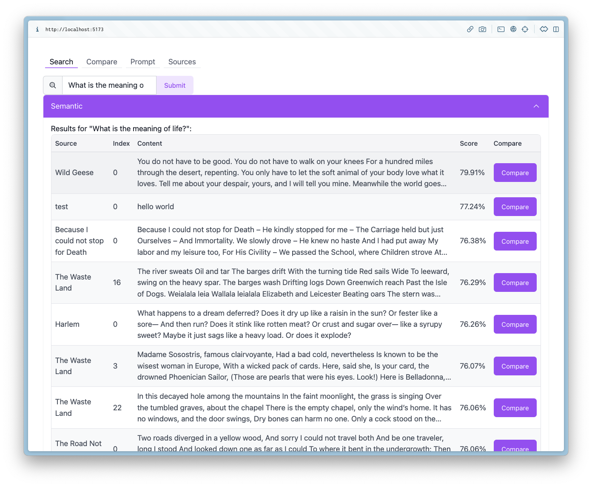

# Embeddings Playground with Pinecone, OpenAI, and Convex

An example of working with embeddings and vector databases in Convex.

[Embeddings](https://stack.convex.dev/the-magic-of-embeddings) enable all sorts
of use cases, but it's hard to know how they'll perform on comparisons and
queries without playing around with them.

This project allows you to add source data, generate embeddings via OpenAI,
compare them to each other, and compare semantic and word searches over them.

You can then use the queried source data to include in a ChatGPT prompt (WIP).



UI:

- React
- Tailwindcss
- Rewind-UI
- Vite

Backend:

- OpenAI API for creating vector embeddings.
- Convex for storing vectors, application data, and running server-side functions.

Work planned:

- [x] Add a python script that scrapes URLs and imports the data.
- [x] Add a node script that imports local files (.pdf, .md, .txt).
- [ ] Allow picking which sources to use in a ChatGPT prompt, and what template to use, to iterate on templates.
- [ ] Configuration to fetch the most 20, 40, or 80 documents when searching (hard-coded to 10 currently).

## Setup

### Prerequisites:

1. A Convex backend: it will be configured automatically on `npm run dev`.
   By running this first, you can enter environment variables for (2) and (3) on
   the [dashboard](https://dashboard.convex.dev).

2. An [OpenAI](https://platform.openai.com/) API key.
   Environment variable: `OPEN_API_KEY` (should start with `sk-`).
   Run `npx convex env set OPEN_API_KEY sk-XXXX # --prod`

## Run:

```bash
npm install
npm run dev
```

## Upload sources from a URL

You can add a source from a URL using the scripts/addURL.py python script:

```sh
pip install dotenv convex langchain
python scripts/addURL.py https://example.com
```

## Upload sources from a folder

You can add .txt, .md, and .pdf files as sources to your project via:

```sh
export VITE_CONVEX_URL= # your backend url - see .env.local (dev) or .env (prod)
npx ts-node-esm scripts/addFiles.ts ./path/to/folder
```

By default it'll check in a documents folder at the root of the repo.
It will upload in chunks
